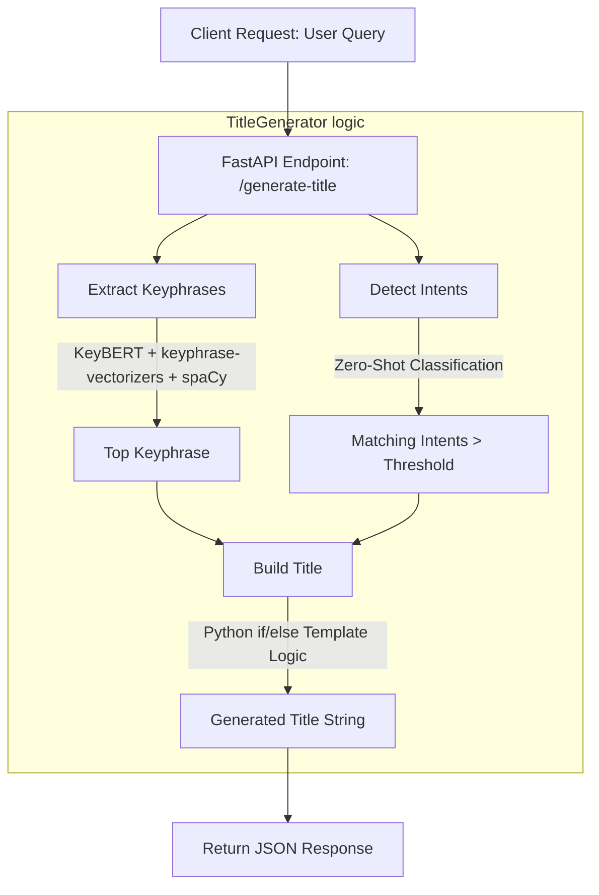

# POC Summary Report: Conversational Title Generation

## 1. Project Objective
The goal of this Proof of Concept (POC) is to automatically generate a short, meaningful title for a conversation based on the user's initial query in a RAG (Retrieval-Augmented Generation) API application. The title should summarize the intent and subject matter of the user's question, capturing the most important entities while being incredibly fast to execute.

## 2. Technologies Used
- **FastAPI**: A modern, high-performance web framework for building APIs with Python.
- **KeyBERT**: A minimal keyword extraction technique that leverages BERT embeddings to find the sub-phrases in a document that are most similar to the document itself.
- **keyphrase-vectorizers**: Used alongside KeyBERT to extract grammatically correct keyphrases (e.g., noun phrases) rather than just individual words.
- **spaCy** (`en_core_web_sm`): An NLP library used by `keyphrase-vectorizers` for Part-of-Speech tagging to identify proper noun phrases.
- **Hugging Face `transformers`**: Used to load a zero-shot multi-label classification pipeline (`cross-encoder/nli-MiniLM2-L6-H768`).
- **Sentence-Transformers**: Used by KeyBERT to generate dense vector embeddings for documents and candidate keyphrases (`all-MiniLM-L6-v2`).

## 3. Function Flow Chart

